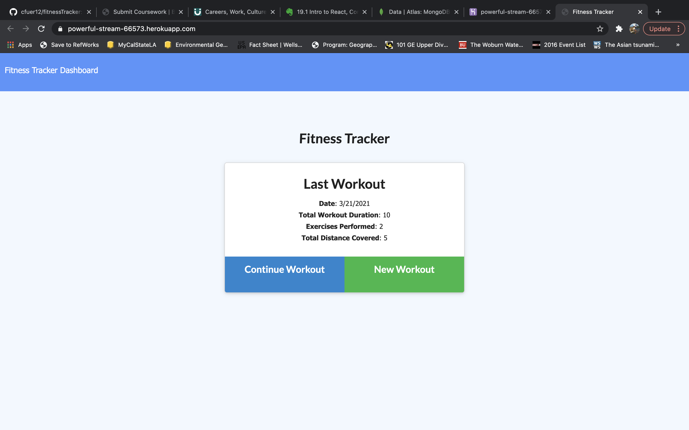

# fitnessTracker

When the user loads the page, they should be given the option to create a new workout or continue with their last workout.

- [Description](#description)
- [Installation](#installation)
- [Usage](#usage)
- [License](#license)
- [Questions](#questions)

## Description

User will be able to log in a workout usimng this fitness tracker app. They will input thier workout into a sperate log window inputting info fields of what they worked on for the day. They can then load all this info onto a dahsboard for them to see their progress over the entire week.

## Installation

install required npm packages: compression, express, mongoose, morgan. run npm run seed to input starting data into database, mongod to run the mongodb server, then npm node server

## Usage

Homework 

## License

MIT

## Questions

Click [here](https://github.com/cfuer12) to visit my Github profile.
Or email all questions to: cfuer12@yahoo.com

Link to deployed site on heroku: [Fitness Tracker](https://powerful-stream-66573.herokuapp.com/)

